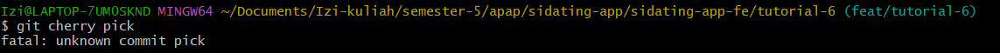
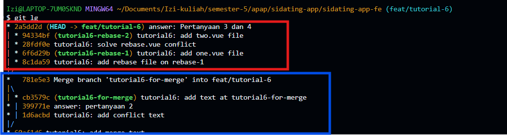

# sidating-app-fe

Praktikum Frontend dengan Vue.js untuk memenuhi mata kuliah Arsitektur dan Pemrograman Aplikasi Perusahaan tahun ajaran 2025/2026 semester gasal

## Hasil unit test

## Jawaban pertanyaan

### Pertanyaan 1
#### Apa yang terjadi setelah git cherry-pick dilakukan?
Setelah menjalankan perintah cherry-pick, file `index.vue` pada branch feat/tutorial-6 yang semulanya kosong, sekarang telah berisi kode yang sesuai dengan isi `index.vue` pada commit pertama dari branch `tutorial6-for-cherrypick` 

#### Apakah kita bisa melakukan cherry-pick tanpa harus melakukan commit?
Tidak. Kita membutuhkan commit-id untuk menjalankan cherry-pick. Apabila kita menjalankan perintah cherrypick tanpa commit-id, maka git akan mengembalikan pesan error (lihat gambar). Maka dari itu, sebuah commit diperlukan untuk melakukan cherry-pick

### Pertanyaan 2
#### Apa yang menjadi penyebab konflik tersebut?
Konflik terjadi karena terdapat dua commit berbeda yang ingin melakukan perubahan di satu file yang sama (`index.vue`). Setelah merge di branch `feat/tutorial-6`, kita menambahkan kode baru pada `index.vue`. Setelah kita melakukan commit pada kode tersebut dan pindah ke branch `tutorial-6-for-merge`, kode yang kita tambahkan pada branch `feat/tutorial-6` akan hilang. Hal ini dikarenakan commit pada branch tutorial-6-for-merge tidak memiliki perubahan terbaru dari branch feat/tutorial-6 sehingga keduanya mengubah bagian file yang sama berdasarkan versi dasar (common ancestor) yang berbeda. Akibatnya, saat dilakukan merge kembali, Git mendeteksi dua perubahan yang saling bertentangan pada baris yang sama dan menandainya sebagai merge conflict.

### Pertanyaan 3
#### Jelaskan perbedaan dari "rebase --continue", "rebase --skip", dan rebase "--abort"!
Saat melakukan rebase, git akan mencoba menerapkan setiap commit dari branch yang sedang di-rebase satu per satu ke atas HEAD dari branch tujuan. Dalam kasus praktikum ini, perintah `git rebase tutorial6-rebase-1` pada branch tutorial6-rebase-2 akan mencoba untuk menambahkan commit-commit dari tutorial6-rebase-2 di atas commit-commit milik `tutorial6-rebase-1`. Ketika terjadi konflik, proses rebase akan terhenti, dan kita akan mendapati 3 opsi.
* rebase --continue. Mencoba untuk melanjutkan proses rebase. Ketika konflik telah kita resolve, perintah ini akan mencoba menjalankan ulang proses rebase yang gagal.
* rebase --skip. Kita dapat memilih untuk melewati commit yang menghasilkan konflik pada proses rebase.
* rebase  --abort. Menghentikan proses rebase secara keseluruhan.

### Pertanyaan 4
#### Apa perbedaan Git Merge dengan Git Rebase?
Git merge akan mencoba menggabungkan dua branch sehingga kedua branch tersebut menyatu dan memiliki satu HEAD yang sama. Proses ini membuat riwayat commit dari kedua branch tetap dipertahankan sehingga hasil akhirnya akan menampilkan percabangan yang kemudian bergabung kembali. Oleh karena itu, hasil visualisasi dari git merge akan tampak paralel.

Di sisi lain, git rebase bekerja dengan cara meletakkan commit dari suatu branch di atas commit branch lain. Dengan demikian, hasil riwayat commit akan tampak linear tanpa percabangan, karena commit-commit lama "dipindahkan" dan disusun ulang di atas branch tujuan rebase.

Perhatikan ilustrasi berikut ini. Ilustrasi berikut didapatkan dengan menjalankan perintah `git log --oneline --graph --decorate --all` (saya menyimpan perintah dengan alias sehingga pada screenshot perintah tersebut dijalankan dengan git lg)
